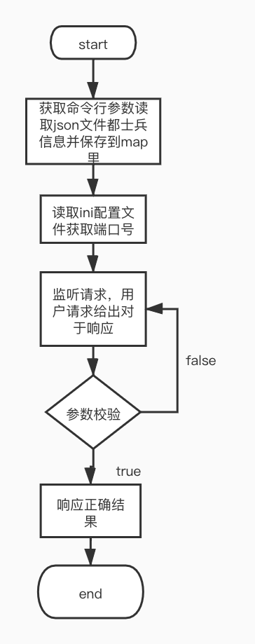

## 项目简介

1、整理士兵配置文件格式且只保留有用的数据，利用gin开发服务响应用户请求并返回数据。

## 目录结构

```tree
├── README.md
├── __pycache__
│   └── locust.cpython-39.pyc
├── app
│   ├── http
│   │   └── httpServer.go
│   ├── main
│   └── main.go
├── conf
│   ├── app.ini
│   ├── config.army.model.json
│   └── soldier.json
├── go.mod
├── go.sum
├── internal
│   ├── ctrl
│   │   └── soldierCtrl.go
│   ├── globalError
│   │   ├── error.go
│   │   └── errorHandler.go
│   ├── handler
│   │   ├── soldierHandler.go
│   │   └── soldierHandler_test.go
│   ├── model
│   │   └── Soldier.go
│   ├── router
│   │   └── routers.go
│   └── verify
│       └── verifyParam.go
├── locust.py
├── report.html
└── util
    ├── iniRead.go
    └── jsonRead.go
```

## 快速上手

1、本项目由Go语言开发，需要配置Go开发环境

2、进入项目根目录，通过命令行命令启动项目

​		1、go build main.go		---编译

​		2、 ./main -p=../conf/config.army.model.json ---通过命令行输入json路径并启动项目

## 逻辑分层

| 层     | 文件夹                              | 主要职责           | 调用关系                  | 其它说明     |
| ------ | ----------------------------------- | ------------------ | ------------------------- | ------------ |
| 应用层 | /app/http/httpServer.go             | 服务器启动         | 调用路由层                | 不可同层调用 |
| 路由层 | /internal/router/router.go          | 路由转发           | 被应用层调用，调用控制层  | 不可同层调用 |
| 控制层 | /internal/ctrl/soldierCtrl.go       | 请求参数处理，响应 | 被路由层调用，调用handler | 不可同层调用 |
| 处理层 | /internal/handler/soldierHandler.go | 处理具体业务       | 被控制层调用              | 不可同层调用 |
| 工具层 | /utils                              | 对配置文件进行处理 | 被handler调用             | 不可同层调用 |

## 存储设计

士兵结构体

```go
type Soldier struct {
	Id           string `json:"id"`           //编号
	Rarity       string `json:"Rarity"`       //稀有度
	UnlockArena  string `json:"UnlockArena"`  //解锁阶段
	Cvc          string `json:"Cvc"`          //客户端版本号
	CombatPoints string `json:"CombatPoints"` //战斗力/战力点
}
```

## 接口设计

#### 请求方式：http.GET

| 请求地址                                  | 请求参数               | 响应结果     | 接口作用                                                     |
| ----------------------------------------- | ---------------------- | ------------ | ------------------------------------------------------------ |
| http://localhost:8000/GetSoldiersByCvc    | cvc                    | 士兵信息json | 根据cvc获取所有合法的士兵                                    |
| http://localhost:8000/GetCombatPointsById | id                     | 战力         | 根据士兵id获取战力                                           |
| http://localhost:8000/GetRarityById       | id                     | 稀有度       | 根据士兵id获取稀有度                                         |
| http://localhost:8000/GetSoldiersByUn     | un                     | 士兵信息json | 根据解锁阶段分组返回士兵信息                                 |
| http://localhost:8000/GetSoldiersByRUCv   | Rarity,UnlockArena,Cvc | 士兵信息json | 输入稀有度、当前解锁阶段、cvc。获取该稀有度、cvc合法且已经解锁的所有士兵 |

#### 响应状态码

| 状态码 | 说明       |
| ------ | ---------- |
| 无     | 成功       |
| 1001   | 参数为空   |
| 1002   | 参数不合法 |
| 1003   | 服务器错误 |
| 1004   | 士兵不存在 |

## 第三方库

##### gopkg.in/ini.v1

```
https://github.com/go-ini/ini
用于读取ini文件
```

##### pflag

```
https://github.com/spf13/pflag
第三方的命令行参数解析包
```

## todo

将项目进一步划分，方便拓展

## 流程图



